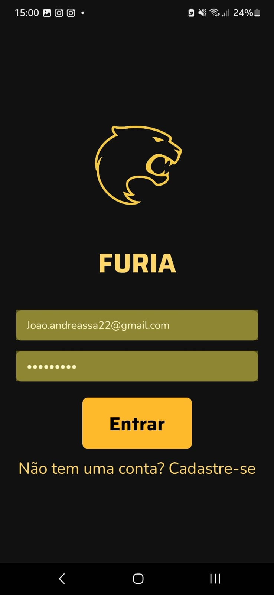
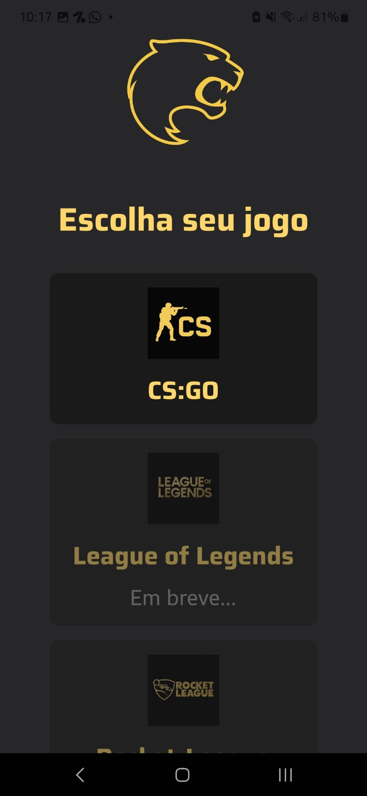
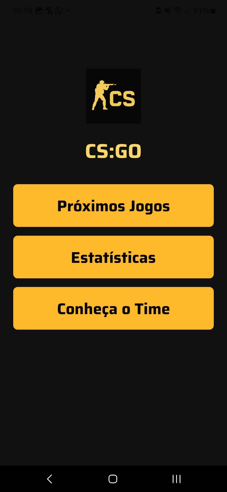
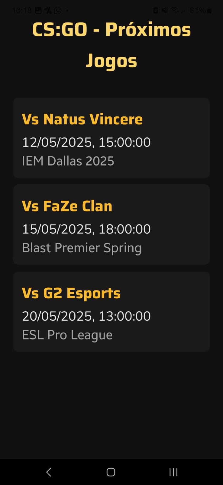
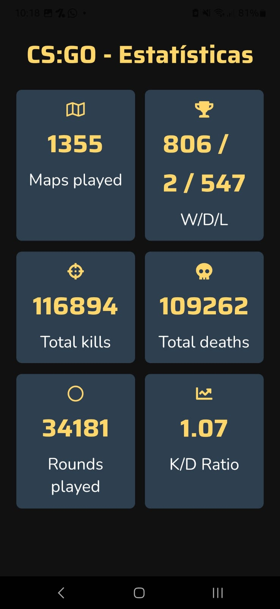
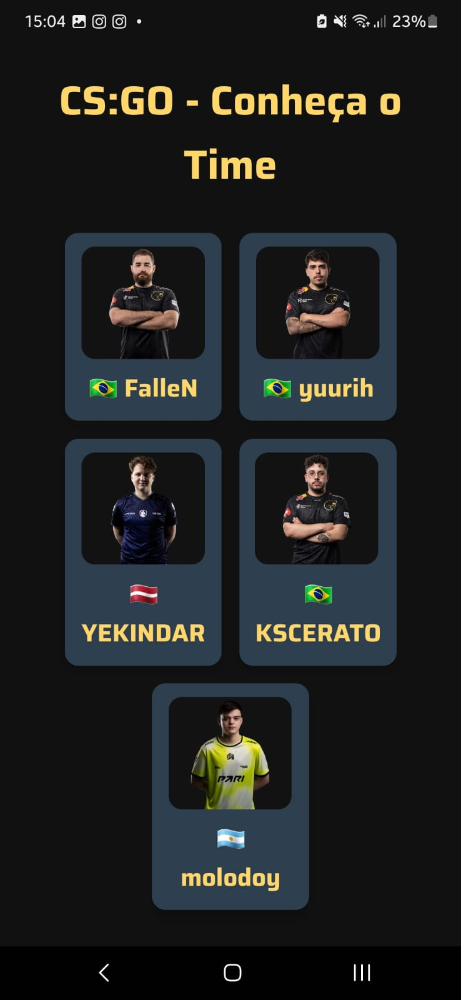
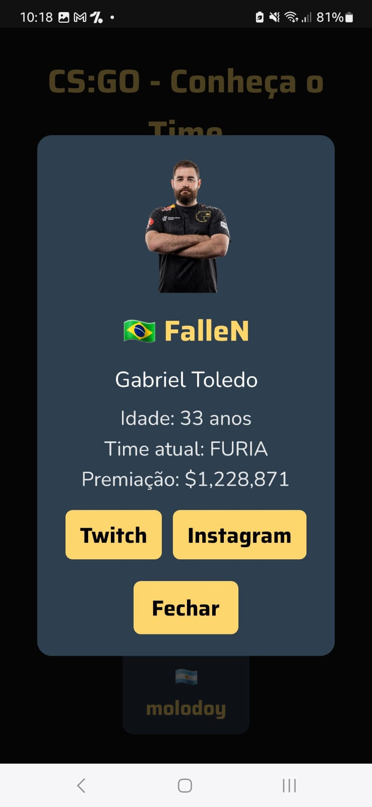

# 🦁 FURIA Fan App

<p align="center">
  
  
  
  
  
  
</p>

Aplicativo mobile feito para os fãs da FURIA Esports!  
Visualize próximos jogos, elenco, estatísticas e conecte-se com o time de forma interativa.

---

## 📸 Demonstração









---

## ✨ Funcionalidades

- Visualizar próximos jogos da FURIA no CS:GO
- Ver estatísticas detalhadas do time
- Conhecer o elenco atual da FURIA
- Acesso rápido aos perfis de Twitch e Instagram dos jogadores
- Animações suaves de interação e toques com feedback tátil
- Interface responsiva e adaptada para experiência mobile

---

## 🚀 Tecnologias utilizadas

- [React Native](https://reactnative.dev/)
- [Expo](https://expo.dev/)
- [TypeScript](https://www.typescriptlang.org/)
- [Expo Haptics](https://docs.expo.dev/versions/latest/sdk/haptics/)
- [React Native Animated API](https://reactnative.dev/docs/animated)

---

## 🔥 Possibilidades de crescimento futuro

- 🔥 Implementar chat em tempo real entre fãs
- 🔥 Integração com APIs de partidas (PandaScore, HLTV, etc)
- 🔥 Notificações push para próximos jogos
- 🔥 Tela de destaques (melhores momentos e clips)
- 🔥 Sistema de login social (Google, Apple, etc)
- 🔥 Rankings e estatísticas individuais dos jogadores
- 🔥 Gamificação: badges para fãs mais ativos
- 🔥 Modo escuro/dark mode personalizado
- 🔥 Personalização de time favorito (FURIA CS, LoL, Rocket League)
- 🔥 Versão web com PWA (Progressive Web App)

---

## 🛠 Como rodar o projeto

1. Clone o repositório:
```bash
git clone https://github.com/JoaoAndreassa/furiaApp.git

2. Instale as dependências:
npm install

2. Rode o projeto:
npm start

Depois, escaneie o QR Code com o aplicativo Expo Go no seu dispositivo móvel!
```