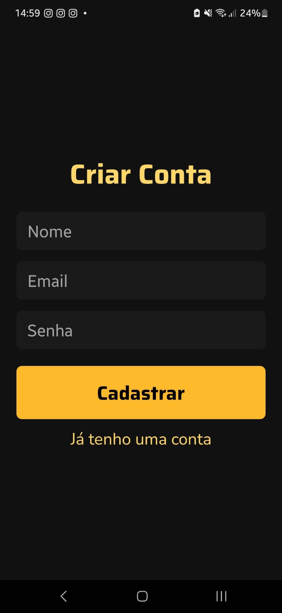
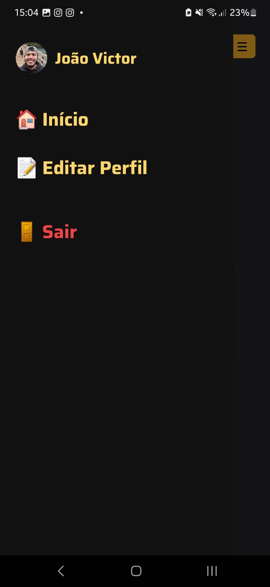
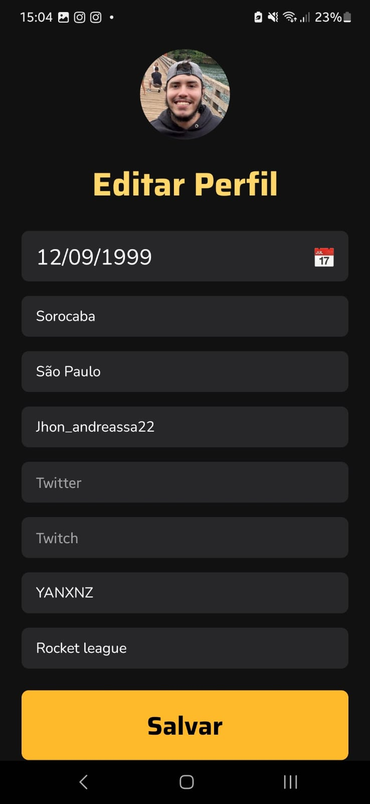
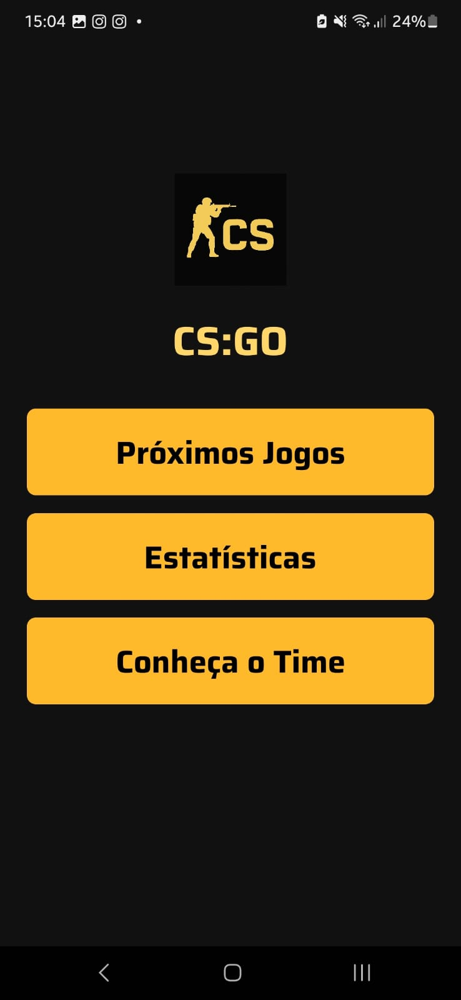
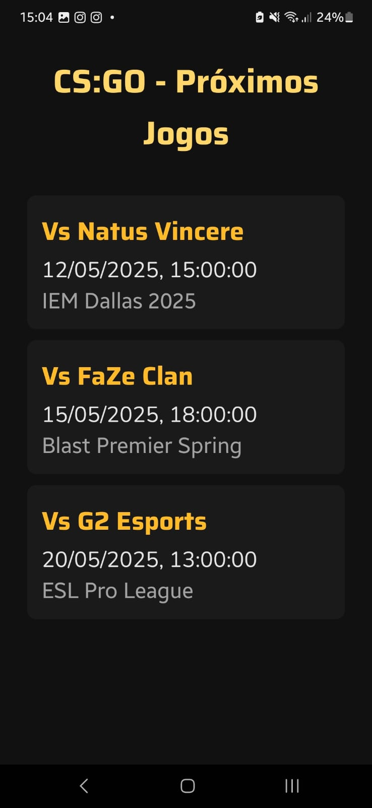

<!-- README.md -->

<p align="center">
  
  
  
  
  
  
</p>

# 🦁 FURIA Fan App

<details>
<summary>🇧🇷 Versão em Português</summary>

Aplicativo mobile feito para os fãs da FURIA Esports!  
Visualize próximos jogos, elenco, estatísticas e conecte-se com o time de forma interativa.

## 📸 Demonstração










## ✨ Funcionalidades

- Visualizar próximos jogos da FURIA no CS
- Ver estatísticas detalhadas do time
- Conhecer o elenco atual da FURIA
- Acesso aos perfis sociais dos jogadores
- Menu lateral com avatar e nome do usuário
- Edição de perfil com seleção de avatar
- Interface responsiva e animada

## 🚀 Tecnologias utilizadas

- React Native
- Expo
- TypeScript
- React Navigation
- Expo Image Picker
- Expo Haptics
- AsyncStorage
- React Native Animated API

## 🛠 Como rodar o projeto

```bash
git clone https://github.com/JoaoAndreassa/furiaApp.git
cd furiaApp
npm install
npm start

Depois, escaneie o QR Code com o Expo Go no seu celular!
```
## 🔮 Futuras melhorias

- Comunidade com posts e comentários
- Histórico de partidas
- Integração com APIs externas
- Suporte a mais jogos (LoL, Rocket League, Kings League, etc..)
- Notificações push
- Login com redes sociais
- Modo escuro
- Gamificação (medalhas, badges)

</details>

<details> <summary>🇺🇸 English Version</summary>

Mobile app made for FURIA Esports fans!
Check upcoming matches, explore team stats, meet the players, and connect with the team in an interactive way.

## 📸 Preview


## ✨ Features
- View upcoming FURIA CS matches
- Check detailed team statistics
- Explore current team roster
- Quick access to players' social media
- Sidebar menu with avatar and user name
- Edit profile with avatar picker
- Responsive and animated interface

## 🚀 Technologies Used
- React Native
- Expo
- TypeScript
- React Navigation
- Expo Image Picker
- Expo Haptics
- AsyncStorage
- React Native Animated API

## 🛠 How to run the project
```bash
git clone https://github.com/JoaoAndreassa/furiaApp.git
cd furiaApp
npm install
npm start
Then scan the QR Code with the Expo Go app on your phone!
```

## 🔮 Future Improvements
- Community feature with posts and comments
- Match history
- Integration with external match APIs
- Support for more games (LoL, Rocket League, Kings League, etc.)
- Push notifications
- Social login (Google, Apple, etc.)
- Dark mode
- Fan gamification (badges, ranks)

</details>